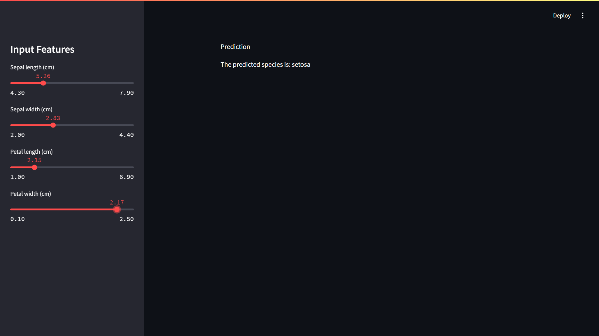

# Iris Flower Species Prediction with Streamlit

This project is an interactive **Streamlit** app that uses machine learning to predict the species of Iris flowers based on their physical features. By using a **RandomForestClassifier** trained on the famous Iris dataset, users can input the values of sepal length, sepal width, petal length, and petal width to predict the species of the flower. The app provides an easy-to-use interface and demonstrates the power of machine learning models.

## Features

- **Interactive UI**: A user-friendly interface built with Streamlit, allowing users to input sepal length, sepal width, petal length, and petal width.
- **Machine Learning Model**: A RandomForestClassifier model that predicts the species of Iris flowers based on the input features.
- **Real-time Predictions**: As soon as the user inputs the flower's features, the app predicts the species in real-time.

## Technology Used

- **Python 3.10**: The primary programming language used for the project.
- **Streamlit**: A Python library that allows for the creation of interactive, real-time web applications with minimal code.
- **Scikit-learn**: A machine learning library that provides the RandomForestClassifier used to predict the species of Iris flowers.
- **Pandas**: A powerful data manipulation library used to handle the Iris dataset.

## Screenshots

Here is the screenshot of the web application:

1. **Prediction Output**
   

